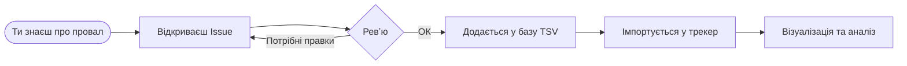

# 🇺🇦 Брак Організації

[](../../issues)
[](../../issues?q=label%3A%22good+first+issue%22)
[](../../commits)
[](../../graphs/contributors)
[](LICENSE)

Слава Україні ! Москаляку на гіляку !

Брак організації -> гірше забезпечення оборонців -> більше втрат серед українців.

За всі роки декілька сотень навдалих рішень, або зволікань. Звучить не так багато, чи зможемо заповнити таблиці?

Публічна спроба трекати продуктивність державних чиновників різного рівня — від міністрів до суддів. Структурована база запитів на ефективність: що мало бути зроблено, що заблоковано, що досі висить без відповіді.

> [!NOTE]
> Знаєш про бездіяльність, блокування або провал? [Задокументуй →](../../issues/new/choose)

---

## Навіщо це

Чиновники рідко несуть відповідальність за бездіяльність — бо її ніхто системно не фіксує. Цей репозиторій — громадський трекер задач для держави:

- **Фіксуємо** конкретні запити до органів влади з джерелами та критеріями виконання
- **Трекаємо** статус — що виконано, що в процесі, що заблоковано або проігноровано
- **Відкриваємо** для всіх — журналістів, активістів, нардепів, розробників

---

## Як це працює



---

## Що сюди потрапляє

Будь-яка дія або бездіяльність державної установи, що шкодить Україні:

- Зволікання з розслідуваннями
- Тиск на незалежні органи
- Корупційні схеми та їх прикриття
- Провали в закупівлях, обороні, судочинстві
- Системні збої у роботі інститутів

> [!IMPORTANT]
> Кожен тікет потребує **конкретного джерела** — документ, публікація, офіційна заява.
> Без джерела — не приймається.

---

## Структура репо

<details>
<summary>Розгорнути</summary>

```
brak-organizatsii/
├── .github/
│   └── ISSUE_TEMPLATE/
│       └── new-ticket.yml     # Форма для пропозиції тікету
├── tickets/
│   ├── _template.tsv          # Шаблон для нового файлу
│   └── *.tsv                  # Файли по темах
├── scripts/
│   ├── validate.py            # Перевірка формату перед імпортом
│   └── merge.py               # Злиття всіх TSV у фінальний CSV
└── docs/
    ├── how-to-add-ticket.md   # Детальна інструкція
    └── jira-field-reference.md
```

</details>

---

## Як додати тікет

**Через форму** — для всіх, без знання git:

**1** → Відкрий [New Issue](../../issues/new/choose) → обери **"Запропонувати тікет"**

**2** → Заповни форму: що сталося, джерело, критерії виконання

**3** → Мейнтейнер конвертує у TSV і додає у базу

> [!TIP]
> Не знаєш до якої теми відноситься — просто опиши подію. Розберемось разом.

**Через Pull Request** — для тих хто знає git:

**1** → Fork репо → скопіюй [`tickets/_template.tsv`](tickets/_template.tsv)

**2** → Додай рядки у відповідний `.tsv` файл або створи новий

**3** → Відкрий Pull Request — він пройде автоматичну валідацію

---

## Формат тікету

| Поле | Обовʼязкове | Опис |
|------|:-----------:|------|
| Summary | ✅ | Конкретна коротка назва — до 200 символів |
| Work type | ✅ | `Epic` / `Story` / `Task` |
| Parent Epic | ➖ | Тема, до якої належить тікет |
| Контекст | ✅ | Що сталося і чому це важливо |
| Джерело | ✅ | Посилання або назва документа |
| Acceptance Criteria | ✅ | Що має статися, щоб проблему вважати вирішеною |
| Priority | ✅ | `Highest` / `High` / `Medium` / `Low` |
| Labels | ➖ | Установа, тема, теги |

Детальніше → [docs/how-to-add-ticket.md](docs/how-to-add-ticket.md)

---

## Поточні теми (Epic-и)

| Тема | Файл | Тікетів |
|------|------|:-------:|
| Справа Шабуніна та права детективів НАБУ | [shabunin-rights.tsv](tickets/shabunin-rights.tsv) | 2 |
| Тиск на НАБУ і САП | [nabu-sap-pressure.tsv](tickets/nabu-sap-pressure.tsv) | 2 |
| Справа Мідас та затримання Галущенка | [midas-case.tsv](tickets/midas-case.tsv) | 2 |
| Відповідальність нардепів та чиновників | [officials.tsv](tickets/officials.tsv) | 3 |
| Проблеми оборонних закупівель | [defense-procurement.tsv](tickets/defense-procurement.tsv) | 1 |
| Судова реформа та співбесіди ВАКС | [vaks-reform.tsv](tickets/vaks-reform.tsv) | 1 |

> [!WARNING]
> Теми постійно оновлюються. Актуальний список — завжди тут, не в шаблоні форми.

---

## Імпорт у трекер

> [!WARNING]
> TODO: інструкція в розробці

---

## Як шукати інформацію для тікетів

Якісний тікет починається з якісного джерела. Ось де шукати:

**Антикорупційні органи**
- [НАБУ](https://nabu.gov.ua) — повідомлення про підозри, затримання, справи
- [САП](https://sap.gov.ua) — процесуальні рішення, обвинувачення
- [ВАКС](https://vaks.gov.ua) — вироки та ухвали суду
- [НАЗК](https://nazk.gov.ua) — декларації, конфлікти інтересів

**Парламент та уряд**
- [Рада](https://rada.gov.ua) — голосування, законопроєкти, запити
- [Prozorro](https://prozorro.gov.ua) — закупівлі та тендери

**НГО та медіа**
- [ЦПК](https://cpk.org.ua) — аналітика та розслідування
- [Схеми](https://www.radiosvoboda.org/z/1245) — відеорозслідування
- [OCCRP](https://occrp.org) — міжнародні розслідування
- [Bihus.Info](https://bihus.info) — журналістські розслідування

> [!TIP]
> Найкращі тікети — ті, що підкріплені **офіційним документом** (ухвала, підозра, протокол) + **журналістським розслідуванням** як контекстом.

---

## AI-аналіз тексту для створення тікетів

У файлі [`docs/prompt.md`](docs/prompt.md) знаходиться промт для аналізу новин та документів за допомогою AI.

**Як використовувати:**

**1** → Відкрий будь-який AI-чат (ChatGPT, Claude, Gemini тощо)

**2** → Скопіюй вміст [`docs/prompt.md`](docs/prompt.md) і встав першим повідомленням

**3** → Додай текст новини або документу, який хочеш проаналізувати

**4** → AI поверне готові тікети у потрібному форматі

Промт навчає AI:
- відрізняти Epic від Story / Task / Bug
- формувати конкретні Summary у форматі `[Дія] + [Об'єкт]`
- заповнювати Description з контекстом, деталями та Acceptance Criteria
- виставляти пріоритети за реальною важливістю
- не вигадувати та не дублювати тікети

---

## Хочеш допомогти інакше?

- 🛠 **Розробникам** — [скрипти для валідації та конвертації](scripts/)
- 🏛 **Нардепам** — використовуй базу для депутатських запитів
- 📰 **Журналістам** — джерела до кожного тікету задокументовані
- 📢 **Активістам** — додавай тікети, коментуй, поширюй

---

## Підтримай проєкт

Чим більше людей знає — тим складніше ігнорувати.

⭐ **Постав зірку** — це сигнал що тема важлива

💬 **Коментуй Issues** — якщо знаєш більше про справу, доповни

🔁 **Поширюй** — у соцмережах, у чатах, колегам, журналістам

---

*Маєш питання або пропозицію щодо самого проєкту — [відкрий Discussion](../../discussions).*
